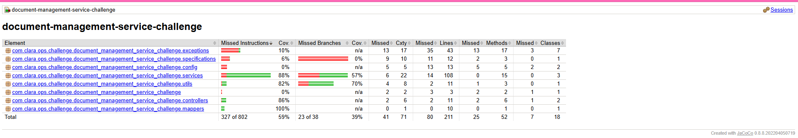

# 📄 Document Management Service – Challenge

A backend system built with **Java 17** and **Spring Boot 3** that allows users to upload, search, and download PDF documents up to **500 MB**.  
The service uses **PostgreSQL** for metadata storage and **MinIO** for storing large files, supporting up to **10 concurrent uploads** while maintaining a low-memory footprint (~50 MB container limit).

---

## 🚀 Features

### 📤 Document Upload
- Upload large PDF files via `multipart/form-data`
- Metadata:
  - `userName`
  - `documentName`
  - `tags[]`
- Validations:
  - Must be PDF
  - Max size: 500MB
  - Required metadata fields
- Streams files (does not load into memory)

---

### 🔍 Document Search
- Filter by:
  - `userName`
  - `documentName`
  - `tags[]`
- Pagination:
  - `page`
  - `size`
- Returns only metadata

---

### ⬇️ Document Download
- Generates a **pre-signed MinIO URL**
- Valid for 3 minutes
- Secure and temporary

---

# 🧱 Architecture & Design

- **Layered architecture**:
  - `controller` → `service` → `repository`/`MinioService`
- **DTOs** to decouple API payloads from persistence entities.
- **MinIO integration** via a dedicated `MinioService`:
  - Upload / download
  - Pre-signed URL generation
- **PostgreSQL schema** optimized for:
  - **Multiple tags per document**
  - Searching by tags and metadata
- **Exception handling** centralized via `@ControllerAdvice`.

---

# 🛠 Requirements

### Local (no Docker)
- Java 17+
- Maven
- PostgreSQL
- MinIO

### Docker (Recommended)
- Docker
- Docker Compose

---

# 🐳 Running with Docker Compose

Move to folder:

```bash
cd docker
```

## 1️⃣ Create `.env`

Recommended create an .env file with the following content,  replace placeholders with your values.

```env
# PostgreSQL
POSTGRES_USER=your_user
POSTGRES_PASSWORD=your_password
POSTGRES_USER_PASSWORD=your_postgres_user_password
# MinIO
MINIO_ACCESS_KEY=minio_access_key
MINIO_SECRET_KEY=minio_secret_key
MINIO_BUCKET_NAME=document-bucket
MINIO_USER=minio_admin_user
MINIO_PASSWORD=minio_admmin_password
```

## 2️⃣ Start Containers

```bash
docker compose up --build
```

This command will:

- Build the application using the Dockerfile defined for the backend service
- Start the PostgreSQL database
- Start the MinIO storage service
- Run the backend application

Application Ports:
- Spring Boot: 8080
- PostgreSQL: 5432
- MinIO (S3): 9000
- MinIO (Web Console): 9001


## 3️⃣ Stop Containers

```bash
docker compose down
```

---

# 📁 Project Structure

```
document-management-service-challenge/
│── docker/
│   └── init-scripts/schema-init.sql
│
│── src/main/java/ # controllers, services, repositories, config
│── src/main/resources/application.properties
│
│── Dockerfile
│── docker-compose.yml
│── README.md
```

---

# 🔐 Environment Variables

Example:

```env
spring.datasource.url=jdbc:postgresql://localhost:5432/challenge
spring.jpa.hibernate.ddl-auto=update
spring.jpa.show-sql=true

spring.servlet.multipart.enabled=true
spring.servlet.multipart.max-file-size=500MB
spring.servlet.multipart.max-request-size=550MB
```
---

# 📘 API Documentation

After starting the application, access the OpenAPI docs at:
`http://localhost:8080/swagger-ui/index.html`

---

# 🧪 Testing & Code Quality

## Run tests

```bash
./mvnw test
```

## Full verification

```bash
./mvnw clean verify
```

---

# 📊 Jacoco Coverage

Generate:

```bash
./mvnw jacoco:report
```

Open:

```
target/site/jacoco/index.html
```

Image with the report generated:



---

# 🧼 Spotless Formatting

```bash
./mvnw spotless:apply
```

---

# 📥 Example Requests

## Upload Document

```http
POST /api/document/upload
Content-Type: multipart/form-data
```

Form-data:

| Key | Type | Value | Content-type |
|-----|------|-------| ---------|
| metadata | text | {"userName":"user1","documentName":"report","tags":["2024"]} | application/json |
| file | file | report.pdf | application/pdf |

---

## Search Documents

```http
GET /api/document/search?userName=user1&tags=2024&page=0&size=10
```

---

## Download Document

```http
GET /api/document/download/{id}
```

Response:

```
"https://minio/presigned-url"
```

---

# 📝 Notes

- File uploads use streaming
- Pre-signed URLs keep storage private
- Memory usage stays low even with large PDFs
- `.env` required for configuration
- MinIO chosen for S3 compatibility

## 📌 Hostname Note: `host.docker.internal` and Pre-Signed URLs

When running the application inside Docker, MinIO generates pre-signed URLs using the hostname `host.docker.internal`.  
This hostname is valid inside the Docker network but cannot be resolved by Postman or the browser on the host machine.

To allow Postman (or your browser) to download files using the pre-signed URL, add the following entry to your system's `hosts` file:
```
127.0.0.1 host.docker.internal
```
Once added, you can access the pre-signed URLs generated by the application running in Docker.

---

## 📄 License
No license specified.